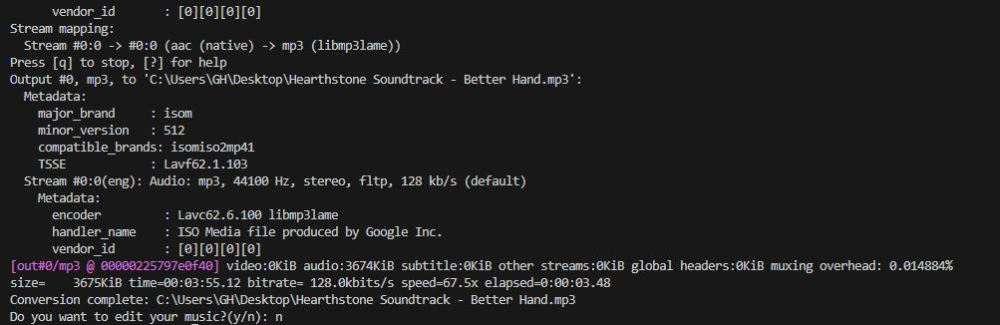

# 🎶 YouTube 音樂下載助手
一鍵下載 YouTube mp3，檔案直接存到桌面、自動命名、過程無多餘資料夾。

技術棧： PowerShell, yt-dlp, FFmpeg

- 輸入 .\M.ps1 執行，開始下載
- 輸入 .\XXL.ps1 執行，開始下載(附加詢問聲音是否加大)
- 更直觀使用: YouTube Music Download Assistant-2.bat ，遵從指示，實現下載。

## ✨ 功能特色
- 下載最佳音質音訊（.webm 或 .m4a）
- 自動轉檔為 `.mp3` 並刪除原始檔案
- 使用 ffmpeg 處理格式轉換
- 避免 playlist 誤下載
- 可選擇剪輯（跳轉至線上工具）

## 🛠 使用方式
1. 安裝 `yt-dlp` 與 `ffmpeg`
2. 執行 `.\M.ps1` 腳本並貼上 YouTube 連結
3. 等待自動下載與轉檔完成
4. 若想剪輯，選擇「y」後跳轉至線上剪輯工具

## 💡 技術亮點
- PowerShell 自動化腳本，流程控制與參數傳遞
- CLI 工具整合與自動化

## 示意圖

## 📄 授權
MIT License

## 未來改進： 
- 增加清單式多檔案下載
- GUI 圖形介面
